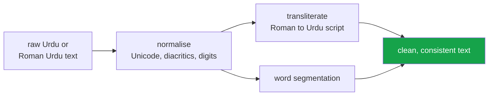

<h1 align="center">urdu-nlp-toolkit (Python · Unicode normalisation · transliteration)</h1>
<p align="center"><i>Urdu and Roman Urdu text processing. Pure Python, zero dependencies, no model downloads</i></p>

<p align="center">
  <a href="#why-this-exists">Why this exists</a> &middot;
  <a href="#what-it-does">What it does</a> &middot;
  <a href="#install">Install</a> &middot;
  <a href="#known-limits">Known limits</a> &middot;
  <a href="#problems-hit-while-building-this">Problems hit</a>
</p>

<p align="center">
  <a href="https://github.com/hammasbuilds/urdu-nlp-toolkit/actions/workflows/ci.yml"></a>
  
  
  
  <a href="LICENSE"></a>
</p>

---

## Why this exists



**Zero dependencies and no model downloads.** Urdu tooling usually assumes a GPU and a
multi-gigabyte model; most preprocessing does not need either, and requiring them puts the
language behind a hardware barrier that English does not have.


Urdu is the national language of a country of 240 million people, and the tooling for
it is close to nonexistent. Every Urdu project starts by rewriting the same four
things badly. This is those four things, written once, with tests.

### The problem nobody handles: the same word has several encodings

Urdu uses a Perso-Arabic script, and text scraped from the web freely mixes Arabic
codepoints with Urdu ones, because most keyboards and many fonts do not distinguish
them:

| Looks like | Arabic codepoint | Urdu codepoint |
|---|---|---|
| ی | `U+064A` ARABIC YEH | `U+06CC` FARSI YEH |
| ک | `U+0643` ARABIC KAF | `U+06A9` KEHEH |
| ہ | `U+0647` ARABIC HEH | `U+06C1` HEH GOAL |

They render identically and compare unequal. Without normalisation, exact match fails,
vocabularies fragment, and every downstream model quietly learns three versions of the
same word.

```python
normalize("كتاب") == normalize("کتاب")   # True. Without it: False.
```

### Roman Urdu, which is what people actually type

Most Pakistanis type Urdu in Latin script — in messages, comments, reviews, support
tickets. It has **no standard orthography**:

```
نہیں  ->  nahi, nahin, nhi, nahee, naheen
ہے    ->  hai, hay, he, h
```

This library does not pretend that is solved. It works in two stages and **tells you
which one answered**:

```python
r = transliterate_with_confidence("mera naam Ali hai")
r.text               # 'میرا نام علی ہے'
r.lexicon_coverage   # 0.5  — half looked up, half guessed by rule
```

A curated lexicon covers the closed-class vocabulary — pronouns, postpositions,
auxiliaries — which is where most tokens in real text actually are, and which rules
cannot disambiguate (`khana` is کھانا *food* or خانہ *compartment*). Longest-match
grapheme rules handle the rest, because no lexicon covers proper nouns. Hiding that
distinction behind a single string would be the dishonest design.

## What it does

| Module | |
|---|---|
| `normalize` | Arabic↔Urdu unification, diacritics, tatweel, zero-width, digits, punctuation. `is_urdu()` script detection. |
| `tokenize` | Sentence splitting on `۔` and `؟`, word tokenisation, merged-compound repair, character n-grams. |
| `translit` | Roman Urdu ↔ Urdu script, with per-token confidence. |
| `stopwords` | 115 function words — **with negation held separately**. |

### Three details that are usually wrong elsewhere

**Urdu punctuation lives inside the Arabic block**, interleaved with the letters. A
range like `؀-ۿ` silently swallows `،` `؟` `۔` into your word tokens. The letter
ranges here skip each punctuation codepoint individually.

**`ھ` (do-chashmi he) marks aspiration**, not a separate consonant — `کھ` is one
sound. Transliterating it as its own letter turns کھانا into `kahana`. It is also a
different codepoint from standalone `ہ`, and confusing the two is the most common
mistake in machine-produced Urdu.

**Negation is not a stopword.** `نہیں` carries the entire meaning of a sentence, and
a stopword list that deletes it inverts every sentiment label. It is kept in a
separate `NEGATION` set and preserved by default:

```python
remove_stopwords(words("یہ اچھا نہیں ہے"))   # ['اچھا', 'نہیں']  — negation survives
```

## Install

```bash
pip install urdu-nlp-toolkit
```

No dependencies, deliberately. This is the layer other Urdu projects sit on, and a
dependency here becomes a dependency of all of them.

---

## Input

One deliberately messy sentence: Arabic `ک` and `ی` rather than the Urdu forms, doubled
spaces, a URL and an English mention.

```
میں  کل  لاہور  سے  آیا  ہوں۔ http://x.co @ali
```

## Output

`python demo.py`

```
remove_urls_and_mentions   میں کل لاہور سے آیا ہوں۔
normalize                  میں کل لاہور سے آیا ہوں۔
words                      میں کل لاہور سے آیا ہوں
remove_stopwords           کل لاہور آیا
transliterate_to_roman     min kal lahor se aaia hon.

6 tokens in, 3 content words out (3 stopwords removed)

Roman -> Urdu, with identifiers left alone:
   dekho http://x.co par    ->  دےکھو http://x.co پر
   @ali ne kaha             ->  @ali نے کہا
   lahore                   ->  لاہور
```

*A transliterated URL is a broken URL, so URLs, emails, `@mentions` and `#hashtags` pass
through untouched. Ordinary English words do **not**: `lahore` gives لاہور, because Roman
Urdu is written in English letters and the two cannot be told apart by spelling.*

*Shown as text, not a screenshot: Urdu is a joining right-to-left script, and an image
renderer without HarfBuzz shaping produces disconnected letters in the wrong order.*

---

## Tests

```bash
pytest
```

**49 tests.** Each encodes a real property of the language rather than a convenient
example, so a failure means the library is wrong about Urdu, not about a fixture.

## Known limits

Stated plainly, because a toolkit that overclaims wastes its users' time:

- **Roman → Urdu is ambiguous by nature.** `sher` is شیر (lion) or شعر (couplet).
  Outside the lexicon it is a best-effort guess, and `lexicon_coverage` tells you how
  much of a given string was guessed.
- **English words inside Roman Urdu are transliterated too.** `lahore` → لاہور is
  correct; `hello` → ہےللو is not, and nothing in the spelling distinguishes them.
  Only *identifiers* — URLs, emails, `@mentions`, `#hashtags` — are recognised by
  syntax and passed through untouched. Strip English spans yourself if you have a
  reliable way to find them.
- **Urdu → Roman is lossy and one-way.** س ص ث all give `s`; the merge cannot be
  undone.
- **Short vowels are inserted heuristically.** Urdu does not write them, so a literal
  mapping gives `jmlh` for جملہ. An `a` between consonants gives `jamalah` — right
  more often than not, wrong sometimes, and disabled with
  `insert_short_vowels=False`.
- **Compound-splitting is a fixed list**, not a model. Deliberately: an aggressive
  splitter does more damage than an incomplete one.
- **No stemmer or lemmatiser.** Urdu morphology needs a lexicon that does not exist
  openly. Use `character_ngrams` as the cheap substitute.

## Keywords

Urdu NLP &middot; Roman Urdu &middot; transliteration &middot; Unicode normalisation &middot; text preprocessing &middot; tokenization &middot; word segmentation &middot; low-resource languages &middot; South Asian languages &middot; Nastaliq &middot; Arabic script &middot; zero dependencies &middot; pure Python &middot; diacritics &middot; language tooling

## License

MIT

---

## Run it yourself

```bash
git clone https://github.com/hammasbuilds/urdu-nlp-toolkit
cd urdu-nlp-toolkit

pip install -e .        # no dependencies to resolve
pytest -q               # 49 tests, ~1 second
```

```python
from urdunlp import normalize, transliterate_to_urdu, words, remove_stopwords

normalize("كتاب")                          # 'کتاب'
transliterate_to_urdu("main theek hoon")   # 'میں ٹھیک ہوں'
words("کیا، واقعی؟", keep_punctuation=True)
remove_stopwords(words("یہ اچھا نہیں ہے")) # ['اچھا', 'نہیں'] — negation kept
```

Works on Python 3.10–3.13, Linux and Windows. No models, no downloads, no GPU.

## Problems hit while building this

**Urdu punctuation lives inside the Arabic letter block.** The obvious range `؀-ۿ`
silently swallows `،` `؟` `۔` into word tokens, so `words("کیا، واقعی؟")` returned
`['کیا،', 'واقعی؟']` — punctuation glued to words, which corrupts every downstream
count. *Fixed* by enumerating letter sub-ranges that skip each punctuation codepoint
individually.

**`ھ` was treated as a standalone consonant.** It marks *aspiration* on the letter
before it — `کھ` is one sound — so inserting a vowel around it turned کھانا into
`kahana` instead of `khana`. *Fixed* by excluding it from vowel insertion, with a test.

**Short vowels do not exist in written Urdu.** A literal character mapping gives `jmlh`
for جملہ, which no Roman Urdu reader would write. *Fixed* with a heuristic `a`
insertion between consonants — right more often than not, and switchable off, because
pretending a heuristic is a rule is how a toolkit loses trust.

**Negation was almost a stopword.** The first stopword list included `نہیں`. That
single word carries the meaning of a sentence, and removing it inverts every sentiment
label. *Fixed* by holding negation in a separate set that is preserved by default.
